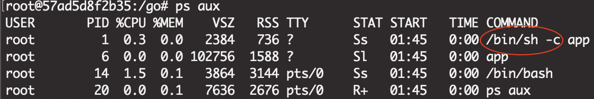
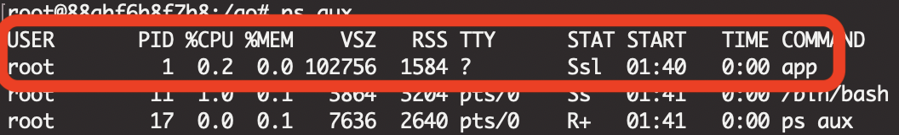

# Synopsis
- Run cmd with PID=1 in the container
- To receive the os.Signal
    - Outstide send os.Signal -> container -> cmd(golang)
- Reference:
    - https://golang.org/pkg/os/
    - https://golang.org/pkg/os/signal/
    - https://golang.org/pkg/syscall/
- About the main.go
    - Here have two func(): ListenAllSignal, ListenSpecificSignal
    - ListenSpecificSignal : You could code what you want to receive from the signal.

# Flow
1. Build go bin, if there have no `ossignalbin` bin file in the app/.
    - `docker run --rm -v $(pwd)/app:/go/src/app -w /go/src/app golang:1.13.1 go build -o ossignalbin`
2. `docker rmi demo && docker build -t demo .`
3. `docker run --rm --name test -d demo && docker logs -f test`
4. `docker stop test`
    - log get : `Signal :  terminated`

> If use `docker kill test`, couldn't get `SIGKILL`.
> Unless sent `docker kill --signal=SIGINT test`; 
> And the bin receive is `Signal :  interrupt`

# Use docker-compose to observe the action....
1. `docker-compose up -d && docker logs -f test`
2. `docker-compose down`, will through do stop then remove
    - `Stopping test ... done`
    - `Removing test ... done`
3. Then bin receive is `Signal :  terminated`

# Others
- If your Dockerfile:CMD run on the wrong way, you will get this:
    - 
- The right way is 
    - 

----
所以說 tini 會將進程的 signal 傳送給 app
https://hynek.me/articles/docker-signals/